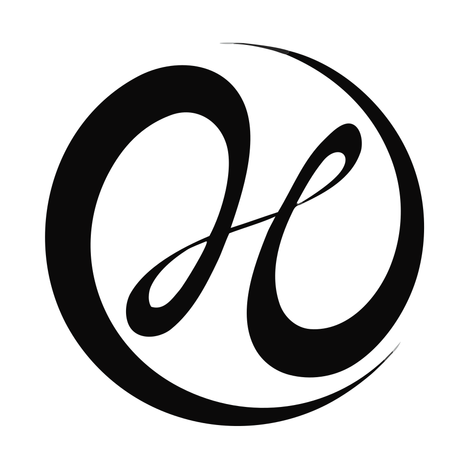
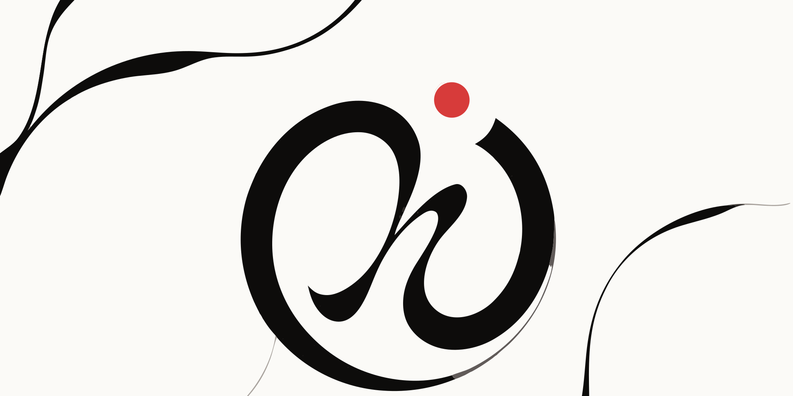
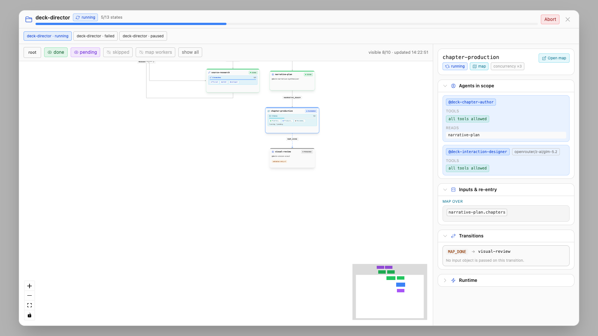

<p align="center"></p>
<h1 align="center">Hyperchart</h1>
<p align="center"><strong>Durable, typed statechart workflows for agents and scripts.</strong></p>
<p align="center"><a href="LICENSE"></a>  </p>

Hyperchart runs long-lived work as an explicit statechart. The chart defines what may run, which event advances it, what data crosses each transition, and how a run can be reconstructed after a crash.



## Choose a package

| Package | Use it for |
|---|---|
| [`@surprisal-io/hyperchart`](packages/hyperchart) | Chart authoring, the pure machine, replay, the generic runtime, and host-neutral models. |
| [`@surprisal-io/pi-hyperchart`](packages/pi-hyperchart) | The Pi extension, `/hyperchart`, agent tools, terminal UI, and React inspector. |

Both packages require Node.js 22.19 or newer. The Pi package depends on the same version of the core package.

## Run a chart in Pi

Install the Pi package from your shell:

```sh
pi install npm:@surprisal-io/pi-hyperchart
```

Create `.pi/hypercharts/hello.chart.ts`:

```ts
import { artifact, chart, final, script } from "@surprisal-io/hyperchart";

export default chart({
  kind: "chart",
  id: "hello",
  initial: "write",
  states: {
    write: {
      kind: "state",
      action: script("node", [
        "-e",
        `require("node:fs").writeFileSync("hello.txt", "Hello from Hyperchart\\n")`,
      ], {
        artifacts: { greeting: artifact("hello.txt") },
      }),
      transitions: { DONE: "done" },
    },
    done: final(),
  },
});
```

A successful script with one non-`FAILED` transition emits that event implicitly. Ask Pi to inspect the chart with `hyperchart_inspect`, then start it:

```text
Use hyperchart_inspect on .pi/hypercharts/hello.chart.ts
/hyperchart run .pi/hypercharts/hello.chart.ts
```

The run writes `hello.txt` and records its history under `.pi/hypercharts/runs/`.

Read [Run your first chart](docs/quickstart.md) for installation checks, expected output, agent setup, and troubleshooting.

## What is durable

A run appends semantic facts to `log.jsonl`: arguments, action invocations, accepted events, map spawns, validation outcomes, and deadline firings. Current state is projected from those facts and the chart definition. It is not restored from a mutable checkpoint.

This makes crash recovery inspectable, but it does not undo external effects. A process may crash after a script or agent caused an external change and before the completion fact was appended. Read [Recovery and safety](docs/safety.md) before overriding replay warnings or rewinding a run.

## Inspector

The Pi package includes a terminal view and a React inspector built from canonical host models. Static chart information and runtime overlays remain separate.



## Architecture


The pure machine requests facts and effects; it does not call Pi directly. The Pi package supplies the runner, agent executor, commands, tools, terminal UI, and React UI. See [Architecture](docs/architecture.md) for the execution loop and formal-model boundary.

## Documentation

- [Run your first chart](docs/quickstart.md)
- [Author charts](docs/core-authoring.md)
- [Compose nested, parallel, and map states](docs/composition.md)
- [Use the Pi extension](docs/pi.md)
- [Operate and recover runs](docs/safety.md)
- [Embed the runtime or React inspector](docs/integration.md)
- [API and file reference](docs/reference.md)
- [Develop and release](docs/development.md)

Hyperchart is experimental. Pin exact package versions for durable runs and keep the chart source that produced each log.
