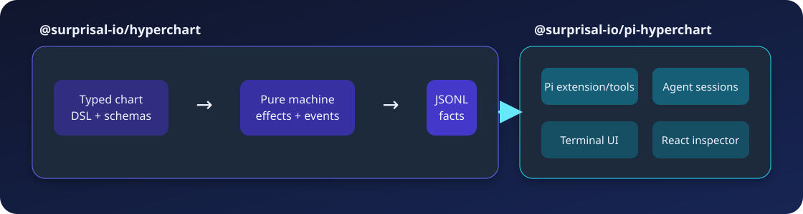

# Architecture



Hyperchart separates chart semantics from effect execution. The core package decides what a run means; a host runtime performs requested work and reports events back.

## Two packages

### `@surprisal/hyperchart`

The core package owns:

- authoring CST and typed refs;
- normalization into the frozen AST;
- generated source and static inspection;
- pure machine and projection;
- durable record contract and replay explanation;
- generic runtime, log, script, guard, artifact, and schema components;
- canonical host/inspector models.

It has no dependency on Pi or React.

### `@surprisal/pi-hyperchart`

The Pi package owns:

- Pi extension and command event API;
- chart, run, and agent-definition discovery;
- detached runner and heartbeat/status files;
- Pi agent executor and session progress;
- `/hyperchart` and four agent tools;
- terminal views;
- React inspector, launch dialog, run strip, and stylesheet;
- bundled Hyperchart skill.

It depends on the exact matching core version. This avoids loading two semantic implementations into one run.

## Definition pipeline

```text
TypeScript chart module
        │ load executable module
        ▼
authoring CST + Zod schemas
        │ normalizeChartConfig()
        ▼
frozen serializable AST + diagnostics
        ├── generated source and static inspector model
        └── machine, projection, and replay
```

The authoring CST is optimized for TypeScript. The AST is flattened, serializable, and explicit about defaults. Normalization resolves paths, assigns action identities, converts schemas, validates transitions and refs, and rejects malformed structure before execution.

Static inspection begins at the AST boundary. It does not need a run, but loading the source module can execute top-level TypeScript.

## Pure decision loop

The machine receives state plus one machine event and returns one output. It does not perform I/O.

```text
ordered facts
    │
    ▼
projection ──► machine ──► append/effect requests
    ▲                          │
    └──── acknowledgements ◄── runtime
```

A runtime iteration:

1. project the branch from durable records;
2. derive the next machine request;
3. persist requested facts before dependent work;
4. dispatch agent, script, timer, validation, rejection, or cancellation effects;
5. feed completion and acknowledgement events back;
6. stop when the root reaches final or the runtime is stopped.

Persist-before-dispatch is important: after a crash, the log can show that an action was invoked even when completion is unknown.

## Facts, not transitions

The durable log records:

- run arguments;
- session references;
- map spawn sets;
- action invocations with normalized definition provenance;
- completion events;
- stored validation verdicts;
- deadline firing.

It does not record transition targets. Projection recomputes targets from completion events and the current AST.

This permits compatible chart edits while making incompatible edits detectable. If a historical event would now route differently, replay must report it rather than restore an old mutable state snapshot.

## Control and data

Control moves through events and transitions.

Data moves through named channels:

- run arguments;
- accepted reply payloads;
- transition inputs;
- pinned map keys/items;
- declared artifact paths;
- visit identity.

Templates resolve those channels immediately before dispatch. Prompt text and ambient files are not implicit workflow state.

## Hierarchy

Normalization flattens nested authoring states to absolute template paths for lookup while retaining parent/scope relationships.

- compound states enter one initial child and complete through a direct final child;
- parallel states enter every region and complete when every region is final;
- maps persist a spawn set, create keyed runtime paths, gate invocation concurrency, and complete when every instance is final.

A transition leaving a scope abandons active descendants. The runtime receives cancellation effects for work that is no longer part of the branch.

## Visits and generations

A state path identifies a node definition. A visit identifies one entry into that node.

Re-entry can create multiple visits of the same path. Maps also create generations: a later entry may spawn a new instance set while old completions remain historical. The runtime model marks those old completions `stale`; it does not present them as pending work in the current generation.

## Host boundary

The generic runtime accepts an `AgentExecutor`. The executor owns provider/session transport, but it must return chart events rather than choosing transition targets.

Pi adds:

- concrete agent definitions and defaults;
- agent sessions and finish tool;
- process lifecycle and heartbeat;
- project/user discovery;
- command, tool, TUI, and React surfaces.

`status.json` and session progress are operational overlays. They do not replace `log.jsonl`.

## Inspector boundary

Canonical inspection has two layers.

**Static:** normalized source, topology, contracts, schemas, transitions, artifact declarations, and definition issues.

**Runtime overlay:** process status, visits, resolved invocations/inputs, map generations, usage, sessions, validation attempts, artifacts, and replay issues.

Adapters produce canonical models. React components do not parse raw logs or rediscover agent definitions independently.

## Formal model

`tla/Hyperchart.tla` is an independent articulation of machine semantics. It is not generated from TypeScript and should not be changed merely to make an implementation test pass.

Model-check scenarios cover review/fix, pipeline, validation gate, fan-out, map, and nesting:

```sh
for M in MCReviewFix MCPipeline MCGate MCFanout MCMap MCNested; do
  tla/check.sh "$M"
done
```

The spec header documents fairness, micro-steps, and deliberately unmodeled host behavior. Read it before editing the machine or model.

## Real trace validation

The trace exporter records a sample run from the TypeScript engine. `tla/HyperchartTrace.tla` checks that the exported trace is admitted by the formal spec.

```sh
node tla/trace/record-sample.mjs
tla/trace/validate.sh sample_chart.ts sample-run.jsonl
```

`TRACE ACCEPTED` means the sampled engine behavior and spec agree. `DIVERGENCE` means the implementation, exporter, or model disagrees and must be investigated.

## Semantic change checklist

A change to normalization, machine, projection, execution loop, or durable facts is complete only when:

1. implementation semantics agree across normalization, projection, and machine;
2. durable-log replay either preserves old meaning or reports incompatibility;
3. replay-check tests cover the contract change;
4. the TLA+ model and model-check configurations agree;
5. the recorded sample trace is accepted;
6. user documentation describes the changed behavior.

Package moves, UI work, and documentation edits must not alter this contract accidentally.

## Related pages

- [Runtime and durability](runtime-and-durability.md)
- [Recovery and safety](safety.md)
- [Development and release](development.md)
